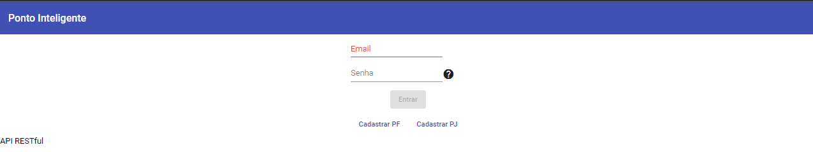
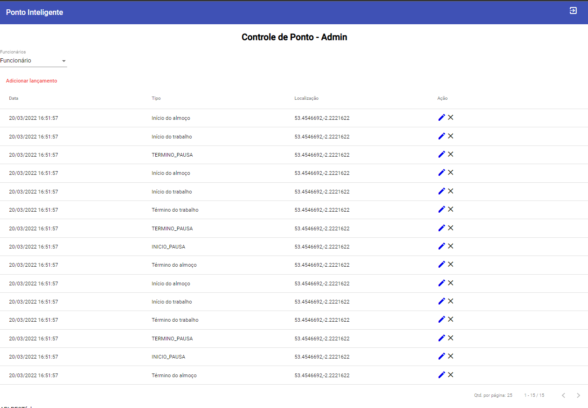
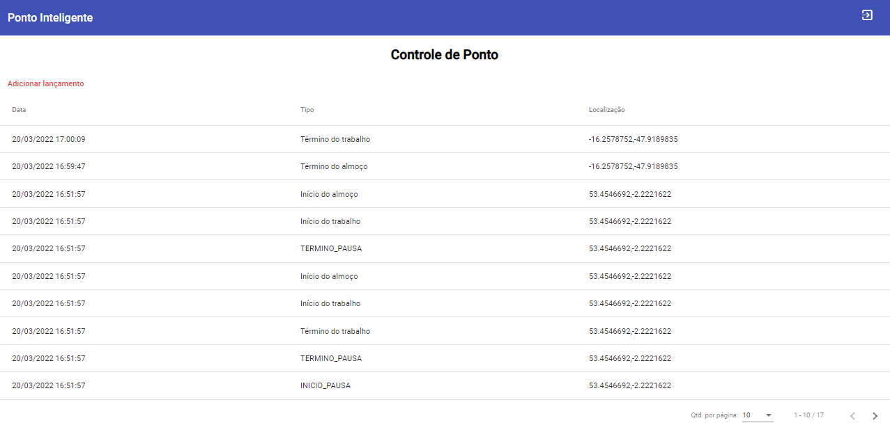
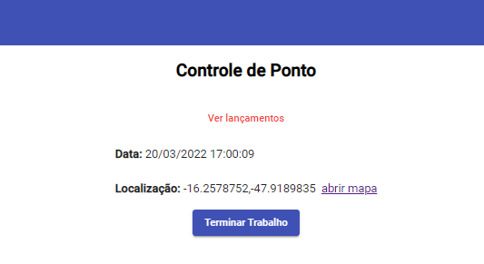

# ponto_inteligente

[](https://www.linkedin.com/in/patrick-cavalcante-moraes-a95635179/)
[](https://github.com/PatrickCavalcant)

O projeto aqui desenvolvido utiliza como padrão o Angular 12 integrado com uma API Restful Java/Spring

<a href="https://github.com/PatrickCavalcant/ponto-inteligente/tree/main/ponto-inteligente-api"> <h3> Ponto Inteligente API </h3> </a>
API do sistema de ponto inteligente com Java e Spring Boot.
### Como executar a aplicação

```
./mvnw spring-boot:run
API será executada em http://localhost:8080
```

<a href="https://github.com/PatrickCavalcant/ponto-inteligente/tree/main/ponto-inteligente-client"> <h3> Ponto Inteligente Cliente </h3> </a>
Código cliente Angular 12 do sistema de ponto inteligente.
### Como executar a aplicação
O código cliente depende da API RESTful, que deverá estar configurada e em execução como requisito.
Para executar o cliente (após a execução da API RESTful), execute os seguintes passos:
```
cd ponto-inteligente-client
npm install -g @angular/cli
npm install
npm start
```
Acesse a aplicação em [http://localhost:4200](http://localhost:4200)  

*Para sua execução certifique-se também de possuir o [NodeJS](http://nodejs.org).*  
*A instalação do @angular/cli acima pode necessitar ser executada como admin do sistema*  


<h4>Tela de Login</h4>

<h4>Interface de Admin</h4>

<h4>Interface do controle do Ponto Inteligente</h4>

<h4>Adicionar Ponto Inteligente</h4>


